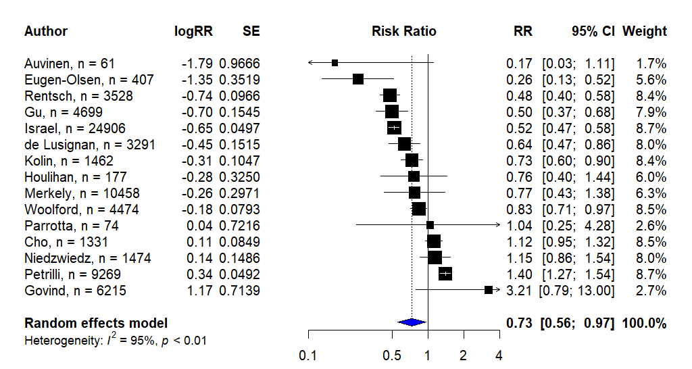
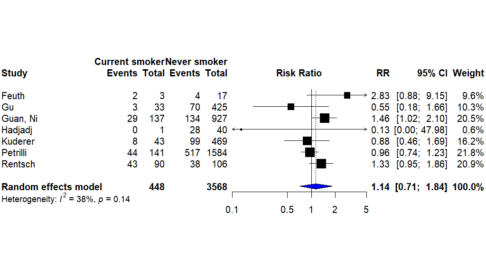
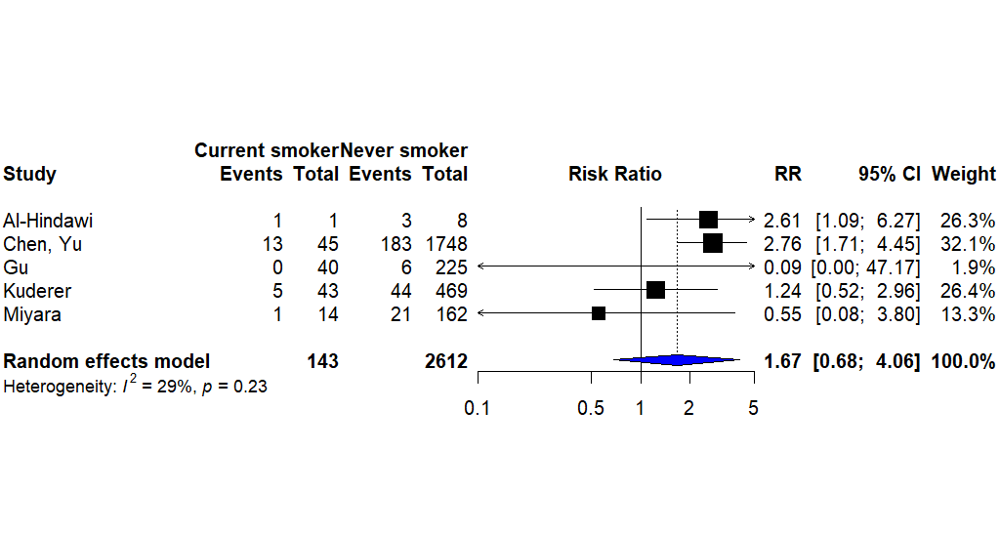
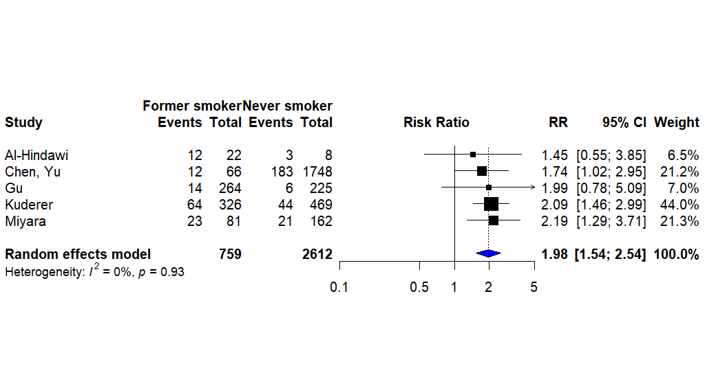

```{r setup, include=FALSE}

knitr::opts_chunk$set(echo = TRUE,
                      warning = F,
                      message = F)

unlink('reports/markdown_report_cache', recursive = TRUE)

```

## Data preparation {.tabset .tabset-fade .tabset-pills}

### Load packages

* **Load packages**: load packages and useful scripts for the analysis

```{r libraries}

library('tidyverse', quietly = T)
library('ggplot2', quietly = T)
library('dplyr', quietly = T)
library('readxl', quietly = T)
library('linelist', quietly = T)
library('googlesheets4', quietly = T)
library('naniar', quietly = T)
library('gridExtra', quietly = T)
library('snakecase', quietly = T)
library('epitools', quietly = T)
library('meta', quietly = T)
library('knitr', quietly = T)
library('kableExtra', quietly = T)
library('snakecase', quietly = T)
library('here', quietly = T)
library('flextable', quietly = T)
```

### Download from Google sheets

* **Load data**: import raw dataset directly from Google sheets

```{r raw_data, cache=T}
here()
sheets_id <- as_sheets_id('https://docs.google.com/spreadsheets/d/15avypGR8ypJngWQEmFIzFrOOwXPY3xezUHQU6jgV7d0/edit?usp=sharing')
search_details <- read_sheet(sheets_id, range = 'article_screening')
data_study_general <- read_sheet(sheets_id, range =  'general_details')
table_1 <- read_sheet(sheets_id, sheet = 'pop_descriptives')
table_2 <-  read_sheet(sheets_id, sheet = 'testing')
table_3 <-  read_sheet(sheets_id, sheet = 'hospitalisation')
table_4 <-  read_sheet(sheets_id, sheet = 'severity')
table_5 <-  read_sheet(sheets_id, sheet = 'mortality')
table_6 <-  read_sheet(sheets_id, sheet = 'quality_appraisal')

```

### Clean data and save updated versions as RDS files

```{r clean_data}

search_details <- search_details %>%
  clean_data() %>%
  rename(date_screened = date_screening_in_format_2020_05_22) %>%
  write_rds(here::here('data_clean', 'search_details.rds'))


protect_columns_1 <- names(data_study_general) %in% 'doi'

data_study_general <- data_study_general %>%
  rename('notes' = 11, date_published = `date_published_format(2020-05-12)`) %>%
  clean_data(protect = protect_columns_1) %>%
  mutate(study_id = 1:length(lead_author)) %>%
  write_rds(here::here('data_clean', 'data_study_general.rds'))

review_details <- data_study_general %>%
  select(lead_author, date_published, country, review_version, study_id) %>%
  write_rds(here::here('data_clean', 'review_details.rds'))

table_1 <- table_1 %>%
  clean_data() %>%
  mutate(., lower_range = sub('\\_.*', '', .$range)) %>%
  mutate(., upper_range = sub('.*_', '',.$range,)) %>%
  select(1:9, 22:23, 11:21) %>%
  filter(!is.na(lead_author)) %>%
  left_join(., review_details, by = 'lead_author') %>%
  write_rds(here::here('data_clean', 'table_1.rds'))

table_2 <-  table_2 %>%
  clean_data() %>%
  filter(data_on_testing == TRUE) %>%
  left_join(., review_details, by = 'lead_author') %>%
  write_rds(here::here('data_clean', 'table_2.rds'))

table_3 <-  table_3 %>%
  clean_data() %>%
  filter(data_on_hospitalisation == TRUE) %>%
  left_join(., review_details, by = 'lead_author') %>%
  write_rds(here::here('data_clean', 'table_3.rds'))

table_4 <-  table_4 %>%
  clean_data() %>%
  filter(data_disease_severity == TRUE) %>%
  left_join(., review_details, by = 'lead_author') %>%
  write_rds(here::here('data_clean', 'table_4.rds'))

table_5 <- table_5 %>%
  clean_data() %>%
  filter(data_on_deaths == TRUE) %>%
  left_join(., review_details, by = 'lead_author') %>%
  write_rds(here::here('data_clean', 'table_5.rds'))


protect_columns_2 <- !names(table_6) %in% 'Author'

table_6 <-  table_6 %>%
  clean_data(protect = protect_columns_2) %>%
  left_join(., table_1 %>%
              select(lead_author,
                     not_stated,
                     missing,
                     total) %>%
              rename('author' = lead_author),
            by = 'author') %>%
  mutate(missingness = rowSums(.[17:18], na.rm = T),
         missingness_percentage = (missingness/total)*100) %>%
  select(-c(not_stated, missing, total, missingness)) %>%
  write_rds(here::here('data_clean', 'table_6.rds'))

a <- data_study_general %>%
  select(lead_author, date_published, source, study_id) %>%
  rename('Lead Author' = lead_author,
         'Date Published' = date_published,
         'Publication Source' = source,
         'Study ID' = study_id)

a$`Lead Author` <- to_upper_camel_case(a$`Lead Author`, sep_out = ", ")
a$`Publication Source` <- to_title_case(a$`Publication Source`)
a$`Publication Source` <- if_else(str_length(a$`Publication Source`) < 5,
                                  toupper(a$`Publication Source`),
                                  to_title_case(a$`Publication Source`))

a <- flextable(a)%>%
  set_caption(a, caption = 'All studies included in data extraction') %>%
  set_table_properties(width = 1, layout = 'autofit') %>%
  save_as_docx(a, path = here('data_clean', 'all_studies.docx'))

```

All data has now been stored in `.rds` format in the `/data_clean` folder. This can be analysed outside of the report using pre-generated scripts or user created scripts. 

## Preparing the descriptive analysis {.tabset .tabset-fade .tabset-pills}

### Choosing which data we want to include in the current review? 

``` {r versioning}

date_of_update <- Sys.Date()

prev_versions <- c('v1', 'v2', 'v3')
#This can categorise which studies we want to look at
current_version <- c('v4')
#This will categorise which studies we are including in the current report

analysed_versions <- c('v1', 'v2', 'v3', 'v4')
#This will incorporate all studies into the current version of the report

exclude_from_analysis <- c('isaric_1', 'isaric_2', 'isaric_3', 'miyara_old', 'isaric_4', 'mehra')

exclude_from_qa <- c('isaric_1', 'isaric_2', 'isaric_3', 'miyara', 'isaric_4', 'mehra')

```
We are currently on **Version `r paste(current_version)`**.
We have excluded from the analysis the following studies: `r knitr::combine_words(exclude_from_analysis)`

### Filter the included studies

``` {r descriptives}

data_study_general <- data_study_general %>%
  filter(review_version %in% analysed_versions) %>%
  filter(!(lead_author %in% exclude_from_analysis)) %>%
  write_csv(., here::here('data_clean', 'data_study_general.csv'))

table_1 <- table_1 %>%
  filter(review_version %in% analysed_versions) %>%
  select(-review_version) %>%
  filter(!(lead_author %in% exclude_from_analysis))

table_2 <- table_2 %>%
  filter(review_version %in% analysed_versions) %>%
  select(-review_version) %>%
  filter(!(lead_author %in% exclude_from_analysis))

table_3 <- table_3 %>%
  filter(review_version %in% analysed_versions) %>%
  select(-review_version) %>%
  filter(!(lead_author %in% exclude_from_analysis))

table_4 <- table_4 %>%
  filter(review_version %in% analysed_versions) %>%
  select(-review_version) %>%
  filter(!(lead_author %in% exclude_from_analysis))

table_5 <- table_5 %>%
  filter(review_version %in% analysed_versions) %>%
  select(-review_version) %>%
  filter(!(lead_author %in% exclude_from_analysis))

table_6 <- table_6 %>%
  filter(!(author %in% exclude_from_qa))

a <- data_study_general %>%
  select(lead_author, date_published, source, study_id) %>%
  rename('Lead Author' = lead_author,
         'Date Published' = date_published,
         'Publication Source' = source,
         'Study ID' = study_id)

a$`Lead Author` <- to_upper_camel_case(a$`Lead Author`, sep_out = ", ")
a$`Publication Source` <- to_title_case(a$`Publication Source`)
a$`Publication Source` <- if_else(str_length(a$`Publication Source`) < 5,
                                  toupper(a$`Publication Source`),
                                  to_title_case(a$`Publication Source`))

a <- flextable(a)%>%
  set_table_properties(width = 1, layout = 'autofit') %>%
  set_caption(caption = 'Studies included in the current analysis')

save_as_docx(a, path = here('data_clean', 'included_studies.docx'))

a
```  

## Descriptive analysis {.tabset .tabset-fade .tabset-pills}

### The PRISMA diagram will be updated with these numbers

``` {r PRISMA}
#Number screened to add to PRISMA
from_prev_version <- data_study_general %>%
  filter(review_version %in% prev_versions) %>%
  filter(!(lead_author %in% exclude_from_analysis)) %>%
  tally()

source(here::here('scripts', 'prisma_function.R'))

PRISMA_v4 <- PRISMA(search_details)
PRISMA_v4 <- as.data.frame(PRISMA_v4)
a <- PRISMA_v4 %>%
  t() %>%
  as.data.frame() %>%
  add_rownames() %>%
  flextable() %>%
  set_header_labels(rowname = 'PRISMA category',
                    V1 = 'Number of studies') %>%
  set_table_properties(width = 1, layout = 'autofit') %>%
  set_caption(caption = 'Data for PRISMA')

save_as_docx(a, path = here('data_clean', 'PRISMA_details.docx'))
a

```

### We summarise where the studies were conducted

``` {r countries}
#Countries
country <- table_1$country %>%
  to_upper_camel_case() %>%
  recode(., 'Usa' = 'USA', 'Uk' = 'UK', 'SaudiArabia' = 'Saudi Arabia') %>%
  table() %>%
  as.data.frame() %>%
  arrange(desc(Freq)) %>%
  rename('Country' = 1,
         'Number' = 2)

ggplot(country, aes(x = reorder(Country, desc(-Number)), y = Number))+
  geom_col()+
  coord_flip()+
  theme_bw()+
  labs(title = 'Countries where studies were performed',
       y = 'Number of studies',
       x = 'Country')

a <- flextable(country) %>%
  set_table_properties(width = 0.5, layout = 'autofit')
a

save_as_docx(a, path = here('data_clean', 'Countries_performing_studies.docx'))  

```

### We sumarise the settings in which they were conducted

``` {r setting}

#Setting
setting <- to_upper_camel_case(data_study_general$study_setting, sep_out = ' ') %>%
  table(.) %>%
  sort('Number of studies', decreasing = T) %>%
  as.data.frame() %>%
  arrange(desc(Freq)) %>%
  rename('Setting' = 1,
         'Number' = 2)

a <- flextable(setting) %>%
  set_table_properties(width = 0.5, layout = 'autofit')
a

save_as_docx(a, path = here('data_clean', 'Countries_performing_studies.docx'))  

```

### We update the number of participants we have included

* **Summary statistics:** This table will give us the mean, median and IQR of the samples in the review 

``` {r numbers}

#Numbers
summary(table_1$sample_size)


```

* **The total number of participants**

``` {r sample}

#Number of participants
sum(table_1$sample_size)

```

### We want to know if they use a CRF or electronic health record

``` {r data_source}

#Source of data
table_1$data_source %>%
  recode('electronic_health_records' = 'Electronic health record',
         'case_report_form' = 'Case report form',
         'not_stated' = 'Not stated') %>%
  table() %>%
  as.data.frame() %>%
  arrange(desc(Freq)) %>%
  rename('Data source' = 1,
         'Number' = 2) %>%
  flextable() %>%
  set_table_properties(width = 0.5, layout = 'autofit')
  

```

### Now about the smoking


* **Smokers**
``` {r smokers}
#Studies reporting smokers
current_smok <- table_1 %>%
  filter(., current_smoker != 'NA')
nrow(current_smok)

```
* **Former smokers**
``` {r former smokers}
#Studies reporting former smokers
former_smok <- table_1 %>%
  filter(., former_smoker != 'NA')
nrow(former_smok)
```
* **Never smokers**
```{r never smokers}
#Studies reporting never smokers
never_smok <- table_1 %>%
  filter(., never_smoker != 'NA')
nrow(never_smok)
```
* **Current/former smokers**
``` {r current former smokers}
#Studies reporting current/former smokers
current_former_smok <- table_1 %>%
  filter(., current_former_smoker != 'NA')
nrow(current_former_smok)
```
* **Missing, never/unknown and not stated**
``` {r missing/never/unknown/not stated}
#Studies reporting missing data
missing_smok <- table_1 %>%
  filter(., missing != 'NA')
nrow(missing_smok)

#Studies reporting never/unknown
never_smok_unknown <- table_1 %>%
  filter(., never_smoker_unknown != 'NA')
nrow(never_smok_unknown)

#Studies with not stated
smok_not_stated <- table_1 %>%
  filter(., not_stated != 'NA')
nrow(smok_not_stated)
```
* **Studies with complete smoking status**
``` {r complete}
#Studies reporting current, former and never smoking status
full_smoking_status <- table_1 %>%
  filter(lead_author %in% current_smok$lead_author) %>%
  filter(lead_author %in% former_smok$lead_author) %>%
  filter(lead_author %in% never_smok$lead_author)

b <- full_smoking_status %>%
  select(lead_author, sample_size, current_smoker, former_smoker, never_smoker, study_id) %>%
  rename('Lead author' = lead_author,
         'Sample size' = sample_size,
         'Current smokers' = current_smoker,
         'Former smokers' = former_smoker,
         'Never smokers' = never_smoker,
         'Study ID' = study_id)

b$`Lead author` <- to_upper_camel_case(b$`Lead author`, sep_out = ", ")

b <- flextable(b) %>%
  set_table_properties(width = 1, layout = 'autofit') %>%
  set_caption(caption = 'Studies with complete smoking status data')
b

nrow(full_smoking_status)
#These are the studies with data on current, former and never smokers
```

``` {r incomplete}
#Studies reporting current or current/former and never smoking
semi_full_smoking_status <- table_1 %>%
  filter(lead_author %in% current_former_smok$lead_author) %>%
  filter(lead_author %in% never_smok$lead_author) %>%
  filter(!lead_author %in% full_smoking_status$lead_author)

b <- semi_full_smoking_status %>%
  select(lead_author, sample_size, current_former_smoker, never_smoker, study_id) %>%
  rename('Lead author' = lead_author,
         'Sample size' = sample_size,
         'Current/former smokers' = current_former_smoker,
         'Never smokers' = never_smoker,
         'Study ID' = study_id)

b$`Lead author` <- to_upper_camel_case(b$`Lead author`, sep_out = ", ")

b <- flextable(b) %>%
  set_table_properties(width = 1, layout = 'autofit') %>%
  set_caption(caption = 'Studies with partially complete smoking status (current/former rather than current and former)')
b

nrow(semi_full_smoking_status)
#Remaining studies
incomplete_smoking_status <- table_1 %>%
  filter(!lead_author %in% full_smoking_status$lead_author) %>%
  filter(!lead_author %in% semi_full_smoking_status$lead_author)

b <- incomplete_smoking_status %>%
  select(lead_author, sample_size, current_smoker, current_former_smoker, former_smoker, never_smoker, not_stated, missing, study_id) %>%
  rename('Lead author' = lead_author,
         'Sample size' = sample_size,
         'Current smoker' = current_smoker,
         'Current/former smokers' = current_former_smoker,
         'Former smoker' = former_smoker,
         'Never smokers' = never_smoker,
         'Not stated' = not_stated,
         'Missing' = missing,
         'Study ID' = study_id)

b$`Lead author` <- to_upper_camel_case(b$`Lead author`, sep_out = ", ")

b <- flextable(b) %>%
  set_table_properties(width = 1, layout = 'autofit') %>%
  set_caption(caption = 'Studies with incomplete smoking status')
b

nrow(incomplete_smoking_status)
```

## Smoking prevalence by country {.tabset .tabset-fade .tabset-pills}
``` {r smoking_country}

#Smoking prevalence by country
country_prevalence_list <- table_1 %>%
  group_by(country) %>%
  mutate(., current_smok_percentage = current_smoker/total*100) %>%
  mutate(., former_smok_percentage = former_smoker/total*100) %>%
  mutate(., missing_percentage = missing/total*100) %>%
  mutate(., not_stated_percentage = not_stated/total*100) %>%
  mutate(never_smoker_percentage = never_smoker/total*100) %>%
  group_split(country)

```
We have split the data into a list where each country can be analysed separately if required

### Graph for smoking prevalence in the countries included


## Final results tables and meta-analyses {.tabset .tabset-fade .tabset-pills}

### Table 1: Included studies
``` {r table_1}

#Updating table 1
table_1_word <- table_1 %>%
  mutate(., current_percentage = current_smoker/total*100) %>%
  mutate(., former_percentage = former_smoker/total*100) %>%
  mutate(., current_former_percentage = current_former_smoker/total*100) %>%
  mutate(., never_smoker_percentage = never_smoker/total*100) %>%
  mutate(., never_smoker_unknown_percentage = never_smoker_unknown/total*100) %>%
  mutate(., not_stated_percentage = not_stated/total*100) %>%
  mutate(., missing_percentage = missing/total*100) %>%
  select(lead_author, date_published, country, sample_size, median_age, iqr_lower, iqr_upper, mean_age, lower_range,
         upper_range, standard_deviation, female_sex_percent, current_percentage, former_percentage, current_former_percentage,
         never_smoker_percentage, never_smoker_unknown_percentage, not_stated_percentage, missing_percentage, study_id)

a <- data_study_general %>%
  select(study_id, study_setting)

table_1_word <- left_join(table_1_word, a, by = 'study_id') %>%
  select(1:4, 21, 5:20)
table_1_word$date_published <- as.Date.character(table_1_word$date_published)
write_rds(table_1_word, here::here('data_clean', 'table_1_word.rds'))

table_1_word <- table_1_word %>%
  mutate(median_mean = ifelse(is.na(median_age), mean_age, median_age))


a <- table_1_word %>%
  mutate(median_mean = ifelse(is.na(median_age), mean_age, median_age),
         mean_used = ifelse(is.na(mean_age), '','^'),
         iqr = ifelse(is.na(iqr_lower), NA, paste(iqr_lower, iqr_upper, sep = '-')),
         range_combined = paste(lower_range, upper_range, sep = '-'),
         range_combined = na_if(range_combined, 'NA-NA'),
         st_dev = paste((as.integer(median_mean-standard_deviation)), as.integer((median_mean+standard_deviation)), sep = '-'),
         st_dev = na_if(st_dev, 'NA-NA'))

a$iqr <- coalesce(a$iqr, a$range_combined, a$st_dev)
a$iqr_used <- coalesce(a$range_used, a$st_dev_used)

a <- a %>%
  select(study_id, lead_author, date_published, country, sample_size, study_setting, median_mean, mean_used, iqr,
         female_sex_percent, current_percentage, current_former_percentage, never_smoker_percentage,
         never_smoker_unknown_percentage, not_stated_percentage, missing_percentage) %>%
  mutate(median_mean = paste(median_mean, mean_used, sep = ''),
         median_mean = na_if(median_mean, NA)) %>%
  select(-mean_used) %>%
  mutate(median_mean = ifelse(median_mean == 'NA', 'NA', paste(paste(median_mean, iqr, sep = ' ('),')', sep = ''))) %>%
  select(-iqr) %>%
  rename('Study ID' = study_id,
         'Lead author' = lead_author,
         'Date published' = date_published,
         'Country' = country,
         'Sample size' = sample_size,
         'Study setting' = study_setting,
         'Median (IQR)' = median_mean,
         'Female %' = female_sex_percent,
         'Current smoker %' = current_percentage,
         'Current/former smokers %' = current_former_percentage,
         'Never smokers %' = never_smoker_percentage,
         'Never/unknown smokers %' = never_smoker_unknown_percentage,
         'Not stated %' = not_stated_percentage,
         'Missing %' = missing_percentage)
         
a$`Lead author` <- to_upper_camel_case(a$`Lead author`, sep_out = ", ")
a$`Lead author` <- a$`Lead author` %>%
  recode('Chow, Us, Cdc' = 'Chow (US CDC)',
         "Gold, Us, Cdc" = "Gold (US CDC)",
         "Miyara, Updated" = "Miyara",
         "De, La, Rica" = "de la Rica",
         "Opensafely, Collaborative" = "The Opensafely Collaborative",
         "Bello, Chavolla" = "Bello-Chavolla",
         "Carrillo, Vega" = "Carillo-Vega",
         "De, Lusignan" = "de Lusignan",
         "Mejia, Vilet" = "Mejia-Vilet",
         "Heili, Frades" = "Heili-Frades",
         "Vaquero, Roncero" = "Vaquero-Roncero",
         "Al, Hindawi" = "Al-Hindawi",
         "Del, Valle" = "del Valle",
         "Soto, Mota" = "Soto-Mota")

a$`Study setting` <-to_title_case(a$`Study setting`, sep_out = " ")
a$`Country` <-to_title_case(a$`Country`, sep_out = " ")
a$`Country` <- a$Country %>%
  recode('Usa' = 'USA',
         'Uk' = 'UK')

numeric_columns <- c('Median (IQR)', 'Female %', 'Current smoker %', 'Current/former smokers %',
                     'Never smokers %', 'Never/unknown smokers %', 'Not stated %', 'Missing %')

a <- flextable(a) %>%
    set_caption(caption = 'Characteristics of included studies') %>%
  colformat_num(col_keys = numeric_columns, digits = 2, na_str = '-', big.mark = ',') %>%
  colformat_num(col_keys = 'Sample size', digits = 0, na_str = '-', big.mark = ',') %>%
  set_table_properties(width = 1, layout = 'autofit')
a

save_as_docx(a, path = here('data_clean', 'Table_1.docx'))
```

### Table 2: Smoking and COVID-19 diagnostic testing
``` {r table_2}

quality_rating <- table_6 %>%
  select(author, 16:17) %>%
  rename('lead_author' = author, 'overall_rating' = 2, 'missingness' = 3) %>%
  clean_data()

#Table 2
table_2_word <-  table_2 %>%
  mutate(., sample = contributing_sample) %>%
  mutate(., negative_test_percentage =formatC(negative_test/sample*100, digits = 2, format = "f"),
         negative_current_percentage = formatC(negative_current_smoker/negative_test*100, digits = 2, format = "f"),
         negative_former_smoker_percentage = formatC(negative_former_smoker/negative_test*100, digits = 2, format = "f"),
         negative_current_former_smoker_percentage = formatC(negative_current_former_smoker/negative_test*100, digits = 2, format = "f"),
         negative_never_smoker_percentage = formatC(negative_never_smoker/negative_test*100, digits = 2, format = "f"),
         negative_not_stated_percentage = formatC(negative_not_stated/negative_test*100, digits = 2, format = "f"),
         positive_test_percentage = formatC(positive_test/sample*100, digits = 2, format = "f"),
         positive_current_smoker_percentage = formatC(positive_current_smoker/positive_test*100, digits = 2, format = "f"),
         positive_former_smoker_percentage = formatC(positive_former_smoker/positive_test*100, digits = 2, format = "f"),
         positive_current_former_smoker_percentage = formatC(positive_current_former_smoker/positive_test*100, digits = 2, format = "f"),
         positive_never_smoker_percentage = formatC(positive_never_smoker/positive_test*100, digits = 2, format = "f"),
         positive_not_stated_percentage = formatC(positive_not_stated/positive_test*100, digits = 2, format = "f")) %>%
  select(-data_on_testing, -missing, -date_published, -sample) %>%
  write_rds(here::here('data_clean', 'table_2_word.rds'))

quality_table_2 <- table_2_word %>%
  left_join(., quality_rating, by = 'lead_author') %>%
  select(lead_author, overall_rating, missingness) %>%
  mutate(overall_quality = ifelse(overall_rating != 'poor' & missingness < 20, 'fair', 'poor')) %>%
  select(lead_author, overall_quality)

a <- table_2_word %>%
  filter(contributing_sample >= 1) %>%
  mutate(Author = lead_author,
         Population_tested = contributing_sample,
         SARS_CoV_2_negative = paste(
           paste(negative_test, 
                 (negative_test_percentage), sep = " ("), "%)", sep = ""),
         N_current_smoker = paste(paste(negative_current_smoker, (negative_current_percentage), sep = " (")
                                  , "%)", sep = ""),
         N_current_smoker = na_if(N_current_smoker, "NA ( NA%)"),
         N_former_smoker = paste(paste(negative_former_smoker, (negative_former_smoker_percentage), sep = " (")
                                 , "%)", sep = ""),
         N_former_smoker = na_if(N_former_smoker, "NA ( NA%)"),
         N_current_former_smoker = paste(paste(negative_current_former_smoker,
                                               (negative_current_former_smoker_percentage), sep = " (")
                                         , "%)", sep = ""),
         N_current_former_smoker = na_if(N_current_former_smoker, "NA ( NA%)"),
         N_never_smoker = paste(paste(negative_never_smoker,
                                      (negative_never_smoker_percentage), sep = " (")
                                , "%)", sep = ""),
         N_never_smoker = na_if(N_never_smoker, "NA ( NA%)"),
         N_not_stated = paste(paste(negative_not_stated,
                                    (negative_not_stated_percentage), sep = " (")
                              , "%)", sep = ""),
         N_not_stated = na_if(N_not_stated, "NA ( NA%)")) %>%
  mutate(SARS_CoV_2_positive = paste(
    paste(positive_test, 
          (positive_test_percentage), sep = " ("), "%)", sep = ""),
    P_current_smoker = paste(paste(positive_current_smoker, (positive_current_smoker_percentage), sep = " (")
                             , "%)", sep = ""),
    P_current_smoker = na_if(P_current_smoker, "NA ( NA%)"),
    P_former_smoker = paste(paste(positive_former_smoker, (positive_former_smoker_percentage), sep = " (")
                            , "%)", sep = ""),
    P_former_smoker = na_if(P_former_smoker, "NA ( NA%)"),
    P_current_former_smoker = paste(paste(positive_current_former_smoker,
                                          (positive_current_former_smoker_percentage), sep = " (")
                                    , "%)", sep = ""),
    P_current_former_smoker = na_if(P_current_former_smoker, "NA ( NA%)"),
    P_never_smoker = paste(paste(positive_never_smoker,
                                 (positive_never_smoker_percentage), sep = " (")
                           , "%)", sep = ""),
    P_never_smoker = na_if(P_never_smoker, "NA ( NA%)"),
    P_not_stated = paste(paste(positive_not_stated,
                               (positive_not_stated_percentage), sep = " (")
                         , "%)", sep = ""),
    P_not_stated = na_if(P_not_stated, "NA ( NA%)")) %>%
  select(Author, Population_tested, SARS_CoV_2_negative, N_current_smoker, N_former_smoker, N_current_former_smoker,
         N_never_smoker, N_not_stated, SARS_CoV_2_positive, P_current_smoker, P_former_smoker, P_current_former_smoker,
         P_never_smoker, P_not_stated)

         
a$Author <- to_upper_camel_case(a$Author, sep_out = ", ")
a$Author  <- a$Author  %>%
  recode("Bello, Chavolla" = "Bello-Chavolla",
         "De, Lusignan" = "de Lusignan",
         "Del, Valle" = "del Valle")

numeric_columns <- c('Population_tested', 'SARS_CoV_2_negative', 'N_current_smoker', 'N_former_smoker',
                     'N_current_former_smoker', 'N_never_smoker', 'N_not_stated', 'SARS_CoV_2_positive', 'P_current_smoker',
                     'P_former_smoker', 'P_current_former_smoker', 'P_never_smoker', 'P_not_stated')
a <- flextable(a) %>%
    set_caption(caption = 'SARS-CoV-2 infection by smoking status') %>%
  colformat_num(col_keys = numeric_columns, digits = 0, na_str = '-', big.mark = ',')

a <- set_header_labels(a,
                       Population_tested = 'Total population tested',
                       SARS_CoV_2_negative = "N (%)",
                       N_current_smoker = "Current smoker (%)",
                       N_former_smoker = "Former smoker (%)",
                       N_current_former_smoker = "Current/former smoker (%)",
                       N_never_smoker = "Never smoker (%)",
                       N_not_stated = "Not stated (%)",
                       SARS_CoV_2_positive = "N (%)",
                       P_current_smoker = "Current smoker (%)",
                       P_former_smoker = "Former smoker (%)",
                       P_current_former_smoker = "Current/former smoker (%)",
                       P_never_smoker = "Never smoker (%)",
                       P_not_stated = "Not stated (%)") %>%
  add_header_row(top = TRUE, values = c("","SARS-CoV-2 negative", "SARS-CoV-2 positive" ), colwidths = c(2, 6, 6)) %>%
  theme_booktabs() %>%
  fix_border_issues() %>%
  set_table_properties(width = 1, layout = 'autofit')  %>%
  colformat_char(na_str = '-')
a

nrow(table_2_word)

save_as_docx(a, path = here('data_clean', 'Table_2.docx'))
```

#### Smoking and testing meta-analysis
``` {r testing_meta}
source(here::here('scripts', 'rr_function.R'))

table_2 <- table_2_word

included_studies <- quality_table_2 %>%
  filter(overall_quality == 'fair') %>%
  select(lead_author)

meta <- tibble('author' = table_2$lead_author,
               'negative_smoker' = table_2$negative_current_smoker,
               'negative_never_smoker' = table_2$negative_never_smoker,
               'positive_smoker' = table_2$positive_current_smoker,
               'positive_never_smoker' = table_2$positive_never_smoker,
               'negative_former_smoker' = table_2$negative_former_smoker,
               'positive_former_smoker' = table_2$positive_former_smoker) %>%
        filter(author %in% included_studies$lead_author)

meta$author <- recode(meta$author, 'rentsch' = 'Rentsch',
                      'cho' = 'Cho',
                      'kolin' = 'Kolin',
                      'de_lusignan' = 'de Lusignan',
                      'parrotta' = 'Parrotta',
                      'israel' = 'Israel')

a <- RR_testing('Rentsch', 'current')
b <- RR_testing('Rentsch', 'former')
c <- RR_testing('Cho', 'current')
d <- RR_testing('Cho', 'former')
e <- RR_testing('Kolin', 'current')
f <- RR_testing('Kolin', 'former')
g <- RR_testing('de Lusignan', 'current')
h <- RR_testing('de Lusignan', 'former')
i <- RR_testing('Parrotta', 'current')
j <- RR_testing('Parrotta', 'former')
k <- RR_testing('Israel', 'current')
l <- RR_testing('Israel', 'former')

data <- list(a,b,c,d,e,f,g,h,i,j,k,l)
k <- do.call(rbind.data.frame, data)

#SEs for Niedzwiedz et al. 2020

#current vs. never

niedz_log_RR_1<-log(1.15)
niedz_log_SE_1<-(log(1.54)-log(0.86))/3.92

k <- k %>%
  add_row(., study = 'Niedzwiedz', smoking_status = 'current', log_RR = niedz_log_RR_1, log_SE = niedz_log_SE_1)
#former vs. never

niedz_log_RR_2<-log(1.42)
niedz_log_SE_2<-(log(1.69)-log(1.19))/3.92

k <- k %>%
  add_row(., study = 'Niedzwiedz', smoking_status = 'former', log_RR = niedz_log_RR_2, log_SE = niedz_log_SE_2)

numbers_in_analysis <- table_2_word %>%
        left_join(., quality_rating, by = 'lead_author') %>%
        filter(., overall_rating != 'poor') %>%
        add_row(lead_author = 'niedzwiedz', contributing_sample = 1474) %>%
        replace_na(list(negative_not_stated = 0, positive_not_stated = 0)) %>%
        mutate(contributing_sample = (contributing_sample - (negative_not_stated+positive_not_stated))) %>%
                       select(lead_author, contributing_sample) %>%
  na.omit()
```
The studies included in meta-analysis are `r knitr::combine_words(included_studies)`.

  * **Current versus never smokers**
```{r current_never}
#current vs. never smokers
current_never_meta <- k %>%
  filter(smoking_status == 'current')
  
a<-metagen(current_never_meta$log_RR,
           current_never_meta$log_SE,
           studlab = c("Rentsch, n = 3528",
                       "Cho, n = 1331", 
                       "Kolin, = 1462", 
                       "de Lusignan, n = 3291", 
                       "Parrotta, n = 74",
                       "Israel, n = 24087 ", 
                       "Niedzwiedz, n = 1474"),
           sm="RR",
           comb.fixed = F, comb.random = T)

png(here::here('reports', 'figure','fig_3.png'), width=1024, height=546, res=120)
forest(a,
       xlim = c(0.3, 2),
       sortvar = a$TE,
       rightlabs = c('RR', '95% CI', 'Weight'),
       leftlabs = c('Author', 'logRR', 'SE'),
       print.tau2 = F,
       col.diamond = 'blue',
       col.diamond.lines = 'black',
       col.square = 'black',
       col.square.lines = 'black',
       digits.sd = 2,
       colgap.forest.left = unit(15,"mm"))
null <- dev.off()

a
```



  * **Former versus never smokers**
```{r former_never}
#former vs. never smokers

current_never_meta <- k %>%
  filter(smoking_status == 'former')

a<-metagen(current_never_meta$log_RR,
           current_never_meta$log_SE,
           studlab = c("Rentsch, n = 3528",
                       "Cho, n = 1331", 
                       "Kolin, = 1462", 
                       "de Lusignan, n = 3291", 
                       "Parrotta, n = 74",
                       "Israel, n = 24087 ", 
                       "Niedzwiedz, n = 1474"),
           sm="RR", comb.fixed = F, comb.random = T)

png(here::here('reports', 'figure','fig_4.png'), width=1024, height=546, res=120)
forest(a,
       xlim = c(0.3, 2),
       sortvar = a$TE,
       rightlabs = c('RR', '95% CI', 'Weight'),
       leftlabs = c('Author', 'logRR', 'SE'),
       print.tau2 = F,
       col.diamond = 'blue',
       col.diamond.lines = 'black',
       col.square = 'black',
       col.square.lines = 'black',
       digits.sd = 2,
       colgap.forest.left = unit(15,"mm"))
null <- dev.off()

a

```


### Table 3: Smoking and COVID-19 hospitalisation
``` {r table_3}

#Table 3
table_3_word <- table_3 %>%
  mutate(., sample = sample_with_outcome) %>%
  mutate(., community_percentage = formatC(number_community/sample*100, digits = 2, format = "f")) %>%
  mutate(., community_current_smoker_percent = formatC(community_current_smoker/number_community*100, digits = 2, format = "f")) %>%
  mutate(., community_former_smoker_percent = formatC(community_former_smoker/number_community*100, digits = 2, format = "f")) %>%
  mutate(., community_current_former_smoker_percent = formatC(community_current_former_smoker/number_community*100, digits = 2, format = "f")) %>%
  mutate(., community_never_smoker_percent = formatC(community_never_smoker/number_community*100, digits = 2, format = "f")) %>%
  mutate(., community_never_unknown_smoker_percent = formatC(community_never_unknown_smoker/number_community*100, digits = 2, format = "f")) %>%
  mutate(., community_not_stated_percent = formatC(community_not_stated/number_community*100, digits = 2, format = "f")) %>%
  mutate(., number_hospitalised_percent = formatC(number_hospitalised/sample*100, digits = 2, format = "f")) %>%
  mutate(., hospitalised_current_smoker_percent = formatC(hospitalised_current_smoker/number_hospitalised*100, digits = 2, format = "f")) %>%
  mutate(., hospitalised_former_smoker_percent = formatC(hospitalised_former_smoker/number_hospitalised*100, digits = 2, format = "f")) %>%
  mutate(., hospitalised_current_former_smoker_percent = formatC(hospitalised_current_former_smoker/number_hospitalised*100, digits = 2, format = "f")) %>%
  mutate(., hospitalised_never_smoker_percent = formatC(hospitalised_never_smoker/number_hospitalised*100, digits = 2, format = "f")) %>%
  mutate(., hospitalised_never_unknown_smoker_percent = formatC(hospitalised_never_unknown_smoker/number_hospitalised*100, digits = 2, format = "f")) %>%
  mutate(., hospitalised_not_stated_percent = formatC(hospitalised_not_stated/number_hospitalised*100, digits = 2, format = "f")) %>%
  select(lead_author, sample_with_outcome, number_community, community_percentage,
         community_current_smoker, community_current_smoker_percent, community_former_smoker, 
         community_former_smoker_percent, community_current_former_smoker,
         community_current_former_smoker_percent, community_never_smoker, community_never_smoker_percent,
         community_never_unknown_smoker, community_never_unknown_smoker_percent, 
         community_not_stated, community_not_stated_percent, number_hospitalised, number_hospitalised_percent,
         hospitalised_current_smoker, hospitalised_current_smoker_percent, hospitalised_former_smoker,
         hospitalised_former_smoker_percent, hospitalised_current_former_smoker, hospitalised_current_former_smoker_percent,
         hospitalised_never_smoker, hospitalised_never_smoker_percent, hospitalised_never_unknown_smoker,
         hospitalised_never_unknown_smoker_percent, hospitalised_not_stated, hospitalised_not_stated_percent) %>%
  write_rds(here::here('data_clean', 'table_3_word.rds'))

quality_table_3 <- table_3_word %>%
  left_join(., quality_rating, by = 'lead_author') %>%
  select(lead_author, overall_rating, missingness) %>%
  mutate(overall_quality = ifelse(overall_rating != 'poor' & missingness < 20, 'fair', 'poor')) %>%
  select(lead_author, overall_quality)

a <- table_3_word %>%
  filter(number_community >= 1) %>%
  mutate(Author = lead_author,
         Population = sample_with_outcome,
         Community = paste(
           paste(number_community, 
                 as.integer(community_percentage), sep = " ("), "%)", sep = ""),
         C_current_smoker = paste(paste(community_current_smoker, (community_current_smoker_percent), sep = " (")
                                  , "%)", sep = ""),
         C_current_smoker = na_if(C_current_smoker, "NA ( NA%)"),
         C_former_smoker = paste(paste(community_former_smoker, (community_former_smoker_percent), sep = " (")
                                 , "%)", sep = ""),
         C_former_smoker = na_if(C_former_smoker, "NA ( NA%)"),
         C_current_former_smoker = paste(paste(community_current_former_smoker,
                                               (community_current_former_smoker_percent), sep = " (")
                                         , "%)", sep = ""),
         C_current_former_smoker = na_if(C_current_former_smoker, "NA ( NA%)"),
         C_never_smoker = paste(paste(community_never_smoker,
                                      (community_never_smoker_percent), sep = " (")
                                , "%)", sep = ""),
         C_never_smoker = na_if(C_never_smoker, "NA ( NA%)"),
         C_never_unknown_smoker = paste(paste(community_never_unknown_smoker,
                                              (community_never_unknown_smoker_percent), sep = " (")
                                        , "%)", sep = ""),
         C_never_unknown_smoker = na_if(C_never_unknown_smoker, "NA ( NA%)"),
         C_not_stated = paste(paste(community_not_stated,
                                    (community_not_stated_percent), sep = " (")
                              , "%)", sep = ""),
         C_not_stated = na_if(C_not_stated, "NA ( NA%)")) %>%
  mutate(Hospitalised = paste(
    paste(number_hospitalised, 
          as.integer(number_hospitalised_percent), sep = " ("), "%)", sep = ""),
    H_current_smoker = paste(paste(hospitalised_current_smoker, (hospitalised_current_smoker_percent), sep = " (")
                             , "%)", sep = ""),
    H_current_smoker = na_if(H_current_smoker, "NA ( NA%)"),
    H_former_smoker = paste(paste(hospitalised_former_smoker, (hospitalised_former_smoker_percent), sep = " (")
                            , "%)", sep = ""),
    H_former_smoker = na_if(H_former_smoker, "NA ( NA%)"),
    H_current_former_smoker = paste(paste(hospitalised_current_former_smoker,
                                          (hospitalised_current_former_smoker_percent), sep = " (")
                                    , "%)", sep = ""),
    H_current_former_smoker = na_if(H_current_former_smoker, "NA ( NA%)"),
    H_never_smoker = paste(paste(hospitalised_never_smoker,
                                 (hospitalised_never_smoker_percent), sep = " (")
                           , "%)", sep = ""),
    H_never_smoker = na_if(H_never_smoker, "NA ( NA%)"),
    H_never_unknown_smoker = paste(paste(hospitalised_never_unknown_smoker,
                                         (hospitalised_never_unknown_smoker_percent), sep = " (")
                                   , "%)", sep = ""),
    H_never_unknown_smoker = na_if(H_never_unknown_smoker, "NA ( NA%)"),
    H_not_stated = paste(paste(hospitalised_not_stated,
                               (hospitalised_not_stated_percent), sep = " (")
                         , "%)", sep = ""),
    H_not_stated = na_if(H_not_stated, "NA ( NA%)")) %>%
  select(Author, Population, Community, C_current_smoker, C_former_smoker, C_current_former_smoker,
         C_never_smoker,C_never_unknown_smoker,C_not_stated, Hospitalised, H_current_smoker, H_former_smoker,
         H_current_former_smoker, H_never_smoker, H_never_unknown_smoker, H_not_stated)

         
a$Author <- to_upper_camel_case(a$Author, sep_out = ", ")
a$Author  <- a$Author  %>%
  recode("Chow, Us, Cdc" = "Chow (US CDC)",
         "Miyara, Updated" = "Miyara",
         "Carrillo, Vega" = "Carrillo-Vega",
         "Heili, Frades" = "Heili-Frades")

numeric_columns <- 'Population'

a <- flextable(a) %>%
    set_caption(caption = 'COVID-19 hospitalisation by smoking status') %>%
  colformat_num(col_keys = numeric_columns, digits = 0, na_str = '-', big.mark = ',') %>%
  colformat_char(na_str = '-')

a <- set_header_labels(a,
                       Population = 'Population with outcome',
                       Community = "N (%)",
                       C_current_smoker = "Current smoker (%)",
                       C_former_smoker = "Former smoker (%)",
                       C_current_former_smoker = "Current/former smoker (%)",
                       C_never_smoker = "Never smoker (%)",
                       C_never_unknown_smoker = "Never/unknown smoker (%)",
                       C_not_stated = "Not stated (%)",
                       Hospitalised = "N (%)",
                       H_current_smoker = "Current smoker (%)",
                       H_former_smoker = "Former smoker (%)",
                       H_current_former_smoker = "Current/former smoker (%)",
                       H_never_smoker = "Never smoker (%)",
                       H_never_unknown_smoker = "Never/unknown smoker (%)",
                       H_not_stated = "Not stated (%)") %>%
  add_header_row(top = TRUE, values = c("","Community", "Hospitalised" ), colwidths = c(2, 7, 7)) %>%
  theme_booktabs() %>%
  fix_border_issues() %>%
  set_table_properties(width = 1, layout = 'autofit')
a

nrow(table_3_word)

save_as_docx(a, path = here('data_clean', 'Table_3.docx'))

```

#### Smoking and hospitalisation meta-analysis

```{r current_never hospitalisaiton, echo = F}
table_3 <- table_3_word
included_studies <- quality_table_3 %>%
  filter(overall_quality == 'fair') %>%
  select(lead_author)
  
```
The studies included in meta-analysis are `r paste(included_studies, sep = ', ')`.

``` {r}
# Data --------------------------------------------------------------------
meta <- tibble('author' = table_3$lead_author,
               'community_smoker' = table_3$community_current_smoker,
               'community_never_smoker' = table_3$community_never_smoker, 
               'hospitalised_smoker' = table_3$hospitalised_current_smoker, 
               'hospitalised_never_smoker' = table_3$hospitalised_never_smoker,
               'community_former_smoker' = table_3$community_former_smoker,
               'hospitalised_former_smoker' = table_3$hospitalised_former_smoker) %>%
  filter(author %in% included_studies$lead_author)
  
meta$author <- recode(meta$author, 'rentsch' = 'Rentsch',
                      'argenziano' = 'Argenziano',
                      'miyara_updated' = 'Miyara',
                      'yanover' = 'Yanover',
                      'hamer' = 'Hamer',
                      'heili_frades' = 'Heili-Frades')

# Current smoker hospitalisation ------------------------------------------
event_rates_smoker <- meta %>%
  mutate(., Ee = hospitalised_smoker) %>%
  mutate(., Ne = (hospitalised_smoker+community_smoker)) %>%
  mutate(., Ec = hospitalised_never_smoker) %>%
  mutate(., Nc = (hospitalised_never_smoker+community_never_smoker)) %>%
  rename('Author' = author) %>%
  select(Author, Ee, Ne, Ec, Nc)

a <- event_rates_smoker

event_rates_smoker <- metabin(Ee,
                              Ne,
                              Ec,
                              Nc,
                              data = event_rates_smoker,
                              studlab = paste(Author),
                              comb.fixed = F,
                              comb.random = T,
                              method.tau = 'SJ',
                              hakn = T,
                              prediction = F,
                              incr = 0.1,
                              sm = 'RR')
png(here::here('reports', 'figure', 'fig_5.png'), width=1480, height=546, res=120)
current_smoker_hospitalisation <- forest(event_rates_smoker,
                                sortvar = Author,
                                xlim = c(0.5, 3),
                                rightlabs = c('RR', '95% CI', 'Weight'),
                                leftlabs = c('Author', 'logRR', 'SE'),
                                lab.e = 'Current smoker',
                                lab.c = 'Never smoker',
                                print.tau2 = F,
                                col.diamond = 'blue',
                                col.diamond.lines = 'black',
                                col.square = 'black',
                                col.square.lines = 'black',
                                digits.sd = 2)
null <- dev.off()

a
```


```{r}
# Former smoker hospitalisation -------------------------------------------
event_rates_former <- meta %>%
  mutate(., Ee = hospitalised_former_smoker) %>%
  mutate(., Ne = (hospitalised_former_smoker+community_former_smoker)) %>%
  mutate(., Ec = hospitalised_never_smoker) %>%
  mutate(., Nc = (hospitalised_never_smoker+community_never_smoker)) %>%
  rename('Author' = author) %>%
  select(Author, Ee, Ne, Ec, Nc)

event_rates_former <- metabin(Ee,
                              Ne,
                              Ec,
                              Nc,
                              data = event_rates_former,
                              studlab = paste(Author),
                              comb.fixed = F,
                              comb.random = T,
                              method.tau = 'SJ',
                              hakn = T,
                              prediction = F,
                              incr = 0.1,
                              sm = 'RR')

a <- event_rates_former

png(here::here('reports', 'figure', 'fig_6.png'), width=1480, height=546, res=120)
former_smoker_hospitalisation <- forest(event_rates_former,
                                         sortvar = Author,
                                         xlim = c(0.5, 5),
                                         rightlabs = c('RR', '95% CI', 'Weight'),
                                         leftlabs = c('Author', 'logRR', 'SE'),
                                         lab.e = 'Former smoker',
                                         lab.c = 'Never smoker',
                                         print.tau2 = F,
                                         col.diamond = 'blue',
                                         col.diamond.lines = 'black',
                                         col.square = 'black',
                                         col.square.lines = 'black',
                                         digits.sd = 2)
null <- dev.off()
a
```


### Table 4: Smoking and COVID-19 disease severity

```{r table_4}

#Table 4
table_4_word <- table_4 %>%
  mutate(., sample = sample_with_severity) %>%
  mutate(., non_severe_disease_percentage = formatC(non_severe_disease/sample*100, digits = 2, format = "f")) %>%
  mutate(., non_severe_current_smoker_percent = formatC(non_severe_current_smoker/non_severe_disease*100, digits = 2, format = "f")) %>%
  mutate(., non_severe_former_smoker_percent = formatC(non_severe_former_smoker/non_severe_disease*100, digits = 2, format = "f")) %>%
  mutate(., non_severe_current_former_smoker_percent = formatC(non_severe_current_former_smoker/non_severe_disease*100, digits = 2, format = "f")) %>%
  mutate(., non_severe_never_smoker_percent = formatC(non_severe_never_smoker/non_severe_disease*100, digits = 2, format = "f")) %>%
  mutate(., non_severe_never_unknown_smoker_percent = formatC(non_severe_never_unknown_smoker/non_severe_disease*100, digits = 2, format = "f")) %>%
  mutate(., non_severe_not_stated_percent = formatC(non_severe_not_stated/non_severe_disease*100, digits = 2, format = "f")) %>%
  mutate(., severe_disease_number_percent = formatC(severe_disease_number/sample*100, digits = 2, format = "f")) %>%
  mutate(., severe_disease_current_smoker_percent = formatC(severe_disease_current_smoker/severe_disease_number*100, digits = 2, format = "f")) %>%
  mutate(., severe_disease_former_smoker_percent = formatC(severe_disease_former_smoker/severe_disease_number*100, digits = 2, format = "f")) %>%
  mutate(., severe_disease_current_former_smoker_percent = formatC(severe_disease_current_former_smoker/severe_disease_number*100, digits = 2, format = "f")) %>%
  mutate(., severe_disease_never_smoker_percent = formatC(severe_disease_never_smoker/severe_disease_number*100, digits = 2, format = "f")) %>%
  mutate(., severe_disease_never_unknown_percent = formatC(severe_disease_never_unknown/severe_disease_number*100, digits = 2, format = "f")) %>%
  mutate(., severe_disease_not_stated_percent = formatC(severe_disease_not_stated/severe_disease_number*100, digits = 2, format = "f")) %>%
  select(lead_author, sample, non_severe_disease, non_severe_disease_percentage, non_severe_current_smoker,
         non_severe_current_smoker_percent, non_severe_former_smoker, non_severe_former_smoker_percent,
         non_severe_current_former_smoker, non_severe_current_former_smoker_percent, non_severe_never_smoker,
         non_severe_never_smoker_percent, non_severe_never_unknown_smoker, non_severe_never_unknown_smoker_percent,
         non_severe_not_stated, non_severe_not_stated_percent, severe_disease_number, severe_disease_number_percent,
         severe_disease_current_smoker, severe_disease_current_smoker_percent, 
         severe_disease_former_smoker, severe_disease_former_smoker_percent, severe_disease_current_former_smoker,
         severe_disease_current_former_smoker_percent, severe_disease_never_smoker, severe_disease_never_smoker_percent,
         severe_disease_never_unknown, severe_disease_never_unknown_percent, severe_disease_not_stated,
         severe_disease_not_stated_percent) %>%
  write_rds(here::here('data_clean', 'table_4_word.rds'))

quality_table_4 <- table_4_word %>%
  left_join(., quality_rating, by = 'lead_author') %>%
  select(lead_author, overall_rating, missingness) %>%
  mutate(overall_quality = ifelse(overall_rating != 'poor' & missingness < 20, 'fair', 'poor')) %>%
  select(lead_author, overall_quality)

a <- table_4_word %>%
  filter(non_severe_disease >= 1) %>%
  mutate(Author = lead_author,
         Population = sample,
         non_severe_disease = paste(
           paste(non_severe_disease, 
                 as.integer(non_severe_disease_percentage), sep = " ("), "%)", sep = ""),
         ns_current_smoker = paste(paste(non_severe_current_smoker, (non_severe_current_smoker_percent), sep = " (")
                                  , "%)", sep = ""),
         ns_current_smoker = na_if(ns_current_smoker, "NA ( NA%)"),
         ns_former_smoker = paste(paste(non_severe_former_smoker, (non_severe_former_smoker_percent), sep = " (")
                                 , "%)", sep = ""),
         ns_former_smoker = na_if(ns_former_smoker, "NA ( NA%)"),
         ns_current_former_smoker = paste(paste(non_severe_current_former_smoker,
                                               (non_severe_current_former_smoker_percent), sep = " (")
                                         , "%)", sep = ""),
         ns_current_former_smoker = na_if(ns_current_former_smoker, "NA ( NA%)"),
         ns_never_smoker = paste(paste(non_severe_never_smoker,
                                      (non_severe_never_smoker_percent), sep = " (")
                                , "%)", sep = ""),
         ns_never_smoker = na_if(ns_never_smoker, "NA ( NA%)"),
         ns_never_unknown_smoker = paste(paste(non_severe_never_unknown_smoker,
                                              (non_severe_never_unknown_smoker_percent), sep = " (")
                                        , "%)", sep = ""),
         ns_never_unknown_smoker = na_if(ns_never_unknown_smoker, "NA ( NA%)"),
         ns_not_stated = paste(paste(non_severe_not_stated,
                                    (non_severe_not_stated_percent), sep = " (")
                              , "%)", sep = ""),
         ns_not_stated = na_if(ns_not_stated, "NA ( NA%)"),
         ) %>%
  mutate(severe_disease = paste(
    paste(severe_disease_number, 
          as.integer(severe_disease_number_percent), sep = " ("), "%)", sep = ""),
    s_current_smoker = paste(paste(severe_disease_current_smoker, (severe_disease_current_smoker_percent), sep = " (")
                             , "%)", sep = ""),
    s_current_smoker = na_if(s_current_smoker, "NA ( NA%)"),
    s_former_smoker = paste(paste(severe_disease_former_smoker, (severe_disease_former_smoker_percent), sep = " (")
                            , "%)", sep = ""),
    s_former_smoker = na_if(s_former_smoker, "NA ( NA%)"),
    s_current_former_smoker = paste(paste(severe_disease_current_former_smoker,
                                          (severe_disease_current_former_smoker_percent), sep = " (")
                                    , "%)", sep = ""),
    s_current_former_smoker = na_if(s_current_former_smoker, "NA ( NA%)"),
    s_never_smoker = paste(paste(severe_disease_never_smoker,
                                 (severe_disease_never_smoker_percent), sep = " (")
                           , "%)", sep = ""),
    s_never_smoker = na_if(s_never_smoker, "NA ( NA%)"),
    s_never_unknown_smoker = paste(paste(severe_disease_never_unknown,
                                         (severe_disease_never_unknown_percent), sep = " (")
                                   , "%)", sep = ""),
    s_never_unknown_smoker = na_if(s_never_unknown_smoker, "NA ( NA%)"),
    s_not_stated = paste(paste(severe_disease_not_stated,
                                 (severe_disease_not_stated_percent), sep = " (")
                           , "%)", sep = ""),
    s_not_stated = na_if(s_not_stated, "NA ( NA%)")) %>%
  select(Author, Population, non_severe_disease, ns_current_smoker, ns_former_smoker,
         ns_current_former_smoker, ns_never_smoker, ns_never_unknown_smoker, ns_not_stated,
         severe_disease, s_current_smoker, s_former_smoker, s_current_former_smoker, s_never_smoker, s_never_unknown_smoker,
         s_not_stated)

         
a$Author <- to_upper_camel_case(a$Author, sep_out = ", ")
a$Author  <- a$Author  %>%
  recode("De, La, Rica"  = "de la Rica",
         "Mejia, Vilet" = "Mejia-Vilet",
         "Vaquero, Roncero" = "Vaquero-Roncero")

numeric_columns <- 'Population'

a <- flextable(a) %>%
    set_caption(caption = 'COVID-19 severity by smoking status') %>%
  colformat_num(col_keys = numeric_columns, digits = 0, na_str = '-', big.mark = ',') %>%
  colformat_char(na_str = '-')

a <- set_header_labels(a,
                       Population = "Population with severity",
                       non_severe_disease = "N (%)",
                       ns_current_smoker = "Current smoker (%)",
                       ns_former_smoker = "Former smoker (%)",
                       ns_current_former_smoker = "Current/former smoker (%)",
                       ns_never_unknown_smoker = "Never/unknown smoker (%)",
                       ns_never_smoker = "Never smoker (%)",
                       ns_not_stated = "Not stated (%)",
                       severe_disease = "N (%)", 
                       s_current_smoker = "Current smoker (%)", 
                       s_former_smoker = "Former smoker (%)", 
                       s_current_former_smoker = "Current/former smoker (%)",
                       s_never_unknown_smoker = "Never/unknown smoker (%)",
                       s_never_smoker = "Never smoker (%)",
                       s_not_stated = "Not stated (%)") %>%
  add_header_row(top = TRUE, values = c("","Non severe disease", "Severe disease" ), colwidths = c(2, 7, 7)) %>%
  theme_booktabs() %>%
  fix_border_issues() %>%
  set_table_properties(width = 1, layout = 'autofit')
a

nrow(table_4_word)
save_as_docx(a, path = here('data_clean', 'Table_4.docx'))

```

#### Smoking and severity meta-analysis
```{r current_never severity, echo = F}
table_4 <- table_4_word
included_studies <- quality_table_4 %>%
  filter(overall_quality == 'fair') %>%
  select(lead_author)
```
The studies included in meta-analysis are `r paste(included_studies, sep = ', ')`.

``` {r}
# Data --------------------------------------------------------------------
meta <- tibble('author' = table_4$lead_author,
               'non_severe_smoker' = table_4$non_severe_current_smoker,
               'non_severe_never_smoker' = table_4$non_severe_never_smoker,
               'severe_smoker' = table_4$severe_disease_current_smoker,
               'severe_never_smoker' = table_4$severe_disease_never_smoker,
               'non_severe_former_smoker' = table_4$non_severe_former_smoker,
               'severe_former_smoker' = table_4$severe_disease_former_smoker) %>%
  filter(author %in% included_studies$lead_author)

meta$author <- recode(meta$author, 'rentsch' = 'Rentsch',
                      'guan_ni' = 'Guan, Ni',
                      'hadjadj' = 'Hadjadj',
                      "feuth" = "Feuth")


# Current smoker severity ------------------------------------------
event_rates_smoker <- meta %>%
  mutate(., Ee = severe_smoker) %>%
  mutate(., Ne = (severe_smoker+non_severe_smoker)) %>%
  mutate(., Ec = severe_never_smoker) %>%
  mutate(., Nc = (severe_never_smoker+non_severe_never_smoker)) %>%
  rename('Author' = author) %>%
  select(Author, Ee, Ne, Ec, Nc)

event_rates_smoker <- metabin(Ee,
                              Ne,
                              Ec,
                              Nc,
                              data = event_rates_smoker,
                              studlab = paste(Author),
                              comb.fixed = T,
                              comb.random = F,
                              method.tau = 'SJ',
                              hakn = F,
                              prediction = F,
                              incr = 0.1,
                              sm = 'RR')
png(here::here('reports', 'figure', 'fig_7.png'), width=1024, height=546, res=120)
current_smoker_severity <- forest(event_rates_smoker,
                                         sortvar = Author,
                                         xlim = c(0.1, 5),
                                         rightlabs = c('RR', '95% CI', 'Weight'),
                                         leftlabs = c('Author', 'logRR', 'SE'),
                                         lab.e = 'Current smoker',
                                         lab.c = 'Never smoker',
                                         print.tau2 = F,
                                         col.diamond = 'blue',
                                         col.diamond.lines = 'black',
                                         col.square = 'black',
                                         col.square.lines = 'black',
                                         digits.sd = 2)
null <- dev.off()

event_rates_smoker
```


```{r}
# Former smoker hospitalisation -------------------------------------------
event_rates_former <- meta %>%
  mutate(., Ee = severe_former_smoker) %>%
  mutate(., Ne = (severe_former_smoker+non_severe_former_smoker)) %>%
  mutate(., Ec = severe_never_smoker) %>%
  mutate(., Nc = (severe_never_smoker+non_severe_never_smoker)) %>%
  rename('Author' = author) %>%
  select(Author, Ee, Ne, Ec, Nc)

event_rates_former <- metabin(Ee,
                              Ne,
                              Ec,
                              Nc,
                              data = event_rates_former,
                              studlab = paste(Author),
                              comb.fixed = F,
                              comb.random = T,
                              method.tau = 'SJ',
                              hakn = F,
                              prediction = F,
                              incr = 0.1,
                              sm = 'RR')

png(here::here('reports', 'figure', 'fig_8.png'), width=1024, height=546, res=120)
former_smoker_severity <- forest(event_rates_former,
                                        sortvar = Author,
                                        xlim = c(0.2, 10),
                                        rightlabs = c('RR', '95% CI', 'Weight'),
                                        leftlabs = c('Author', 'logRR', 'SE'),
                                        lab.e = 'Former smoker',
                                        lab.c = 'Never smoker',
                                        print.tau2 = F,
                                        col.diamond = 'blue',
                                        col.diamond.lines = 'black',
                                        col.square = 'black',
                                        col.square.lines = 'black',
                                        digits.sd = 2)
null <- dev.off()

event_rates_former

```


### Table 5: Smoking and COVID-19 mortality

```{r table_5}

#Table 5
table_5_word <- table_5 %>%
  mutate(., sample = sample_with_deaths) %>%
  mutate(., deaths_percentage = formatC(deaths/sample*100, digits = 2, format = "f")) %>%
  mutate(., death_current_smokers_percent = formatC(death_current_smokers/deaths*100, digits = 2, format = "f")) %>%
  mutate(., death_former_smokers_percent = formatC(death_former_smokers/deaths*100, digits = 2, format = "f")) %>%
  mutate(., death_current_former_smokers_percent = formatC(death_current_former_smokers/deaths*100, digits = 2, format = "f")) %>%
  mutate(., death_never_smokers_percent = formatC(death_never_smokers/deaths*100, digits = 2, format = "f")) %>%
  mutate(., death_never_unknown_smokers_percent = formatC(death_never_unknown_smokers/deaths*100, digits = 2, format = "f")) %>%
  mutate(., death_not_stated_percent = formatC(death_not_stated/deaths*100, digits = 2, format = "f")) %>%
  mutate(., recovered_percentage = formatC(recovered/sample*100, digits = 2, format = "f")) %>%
  mutate(., recovered_current_smokers_percent = formatC(recovered_current_smoking/recovered*100, digits = 2, format = "f")) %>%
  mutate(., recovered_former_smokers_percent = formatC(recovered_former_smoker/recovered*100, digits = 2, format = "f")) %>%
  mutate(., recovered_current_former_smokers_percent = formatC(recovered_current_former_smokers/recovered*100, digits = 2, format = "f")) %>%
  mutate(., recovered_never_smokers_percent = formatC(recovered_never_smoker/recovered*100, digits = 2, format = "f")) %>%
  mutate(., recovered_never_unknown_smokers_percent = formatC(recovered_never_unknown_smoker/recovered*100, digits = 2, format = "f")) %>%
  mutate(., recovered_not_stated_percent = formatC(recovered_not_stated/recovered*100, digits = 2, format = "f")) %>%
  select(lead_author, sample, recovered, recovered_percentage, recovered_current_smoking, recovered_current_smokers_percent,
         recovered_former_smoker, recovered_former_smokers_percent, recovered_current_former_smokers,
         recovered_current_former_smokers_percent, recovered_never_smoker, recovered_never_smokers_percent,
         recovered_never_unknown_smoker, recovered_never_unknown_smokers_percent, recovered_not_stated,
         recovered_not_stated_percent,
         deaths, deaths_percentage, death_current_smokers, death_current_smokers_percent,
         death_former_smokers, death_former_smokers_percent, death_current_former_smokers,
         death_current_former_smokers_percent, death_never_smokers, death_never_smokers_percent,
         death_never_unknown_smokers, death_never_unknown_smokers_percent, death_not_stated, death_not_stated_percent) %>%
  write_rds(here::here('data_clean', 'table_5_word.rds'))

quality_table_5 <- table_5_word %>%
  left_join(., quality_rating, by = 'lead_author') %>%
  select(lead_author, overall_rating, missingness) %>%
  mutate(overall_quality = ifelse(overall_rating != 'poor' & missingness < 20, 'fair', 'poor')) %>%
  select(lead_author, overall_quality)

a <- table_5_word %>%
  filter(recovered >= 1) %>%
  mutate(Author = lead_author,
         Population = sample,
         recovered = paste(
           paste(recovered, 
                 as.integer(recovered_percentage), sep = " ("), "%)", sep = ""),
         recovered_current_smoker = paste(paste(recovered_current_smoking, 
                                                 (recovered_current_smokers_percent), sep = " (")
                                  , "%)", sep = ""),
         recovered_current_smoker = na_if(recovered_current_smoker, "NA ( NA%)"),
         recovered_former_smoker = paste(paste(recovered_former_smoker,
                                               (recovered_former_smokers_percent), sep = " (")
                                 , "%)", sep = ""),
         recovered_former_smoker = na_if(recovered_former_smoker, "NA ( NA%)"),
         recovered_current_former_smoker = paste(paste(recovered_current_former_smokers,
                                               (recovered_current_former_smokers_percent), sep = " (")
                                         , "%)", sep = ""),
         recovered_current_former_smoker = na_if(recovered_current_former_smoker, "NA ( NA%)"),
         recovered_never_smoker = paste(paste(recovered_never_smoker,
                                      (recovered_never_smokers_percent), sep = " (")
                                , "%)", sep = ""),
         recovered_never_smoker = na_if(recovered_never_smoker, "NA ( NA%)"),
         recovered_never_unknown_smoker = paste(paste(recovered_never_unknown_smoker,
                                              (recovered_never_unknown_smokers_percent), sep = " (")
                                        , "%)", sep = ""),
         recovered_never_unknown_smoker = na_if(recovered_never_unknown_smoker, "NA ( NA%)"),
         recovered_not_stated = paste(paste(recovered_not_stated,
                                    (recovered_not_stated_percent), sep = " (")
                              , "%)", sep = ""),
         recovered_not_stated = na_if(recovered_not_stated, "NA ( NA%)")) %>%
  mutate(deaths = paste(
           paste(deaths, 
                 as.integer(deaths_percentage), sep = " ("), "%)", sep = ""),
         death_current_smoker = paste(paste(death_current_smokers, 
                                                 (death_current_smokers_percent), sep = " (")
                                  , "%)", sep = ""),
         death_current_smoker = na_if(death_current_smoker, "NA ( NA%)"),
         death_former_smoker = paste(paste(death_former_smokers,
                                               (death_former_smokers_percent), sep = " (")
                                 , "%)", sep = ""),
         death_former_smoker = na_if(death_former_smoker, "NA ( NA%)"),
         death_current_former_smoker = paste(paste(death_current_former_smokers,
                                               (death_current_former_smokers_percent), sep = " (")
                                         , "%)", sep = ""),
         death_current_former_smoker = na_if(death_current_former_smoker, "NA ( NA%)"),
         death_never_smoker = paste(paste(death_never_smokers,
                                      (death_never_smokers_percent), sep = " (")
                                , "%)", sep = ""),
         death_never_smoker = na_if(death_never_smoker, "NA ( NA%)"),
         death_never_unknown_smoker = paste(paste(death_never_unknown_smokers,
                                              (death_never_unknown_smokers_percent), sep = " (")
                                        , "%)", sep = ""),
         death_never_unknown_smoker = na_if(death_never_unknown_smoker, "NA ( NA%)"),
         death_not_stated = paste(paste(death_not_stated,
                                    (death_not_stated_percent), sep = " (")
                              , "%)", sep = ""),
         death_not_stated = na_if(death_not_stated, "NA ( NA%)")) %>%
  select(Author, Population, recovered, recovered_current_smoker, recovered_former_smoker, recovered_current_former_smoker,
         recovered_never_smoker, recovered_never_unknown_smoker, recovered_not_stated, deaths, death_current_smoker,
         death_former_smoker, death_current_former_smoker, death_never_smoker, death_never_unknown_smoker,
         death_not_stated)

         
a$Author <- to_upper_camel_case(a$Author, sep_out = ", ")
a$Author  <- a$Author  %>%
  recode("Carrillo, Vega"  = "Carillo-Vega",
         "Heili, Frades" = "Heili-Frades",
         "Al, Hindawi" = "Al-Hindawi",
         "Soto, Mota" = "Soto-Mota")

numeric_columns <- 'Population'

a <- flextable(a) %>%
    set_caption(caption = 'COVID-19 mortality by smoking status') %>%
  colformat_num(col_keys = numeric_columns, digits = 0, na_str = '-', big.mark = ',') %>%
  colformat_char(na_str = '-')

a <- set_header_labels(a,
                       Population = "Population with mortality",
                       recovered = "N (%)",
                       recovered_current_smoker = "Current smoker (%)",
                       recovered_former_smoker = "Former smoker (%)",
                       recovered_current_former_smoker = "Current/former smoker (%)",
                       recovered_never_unknown_smoker = "Never/unknown smoker (%)",
                       recovered_never_smoker = "Never smoker (%)",
                       recovered_not_stated = "Not stated (%)",
                       deaths = "N (%)", 
                       death_current_smoker = "Current smoker (%)", 
                       death_former_smoker = "Former smoker (%)", 
                       death_current_former_smoker = "Current/former smoker (%)",
                       death_never_unknown_smoker = "Never/unknown smoker (%)",
                       death_never_smoker = "Never smoker (%)",
                       death_not_stated = "Not stated (%)") %>%
  add_header_row(top = TRUE, values = c("","Recovered", "Died" ), colwidths = c(2, 7, 7)) %>%
  theme_booktabs() %>%
  fix_border_issues() %>%
  set_table_properties(width = 1, layout = 'autofit')
a

nrow(table_5_word)

save_as_docx(a, path = here('data_clean', 'Table_5.docx'))

```

#### Smoking and COVID-19 mortality meta-analysis

```{r current_never mortality, echo = F}
table_5 <- table_5_word
included_studies <- quality_table_5 %>%
  filter(overall_quality == 'fair') %>%
  select(lead_author)
```
The studies included in meta-analysis are `r paste(included_studies, sep = ', ')`.

``` {r}
# Data --------------------------------------------------------------------
meta <- tibble('author' = table_5$lead_author,
               'recovered_current_smoker' = table_5$recovered_current_smoking,
               'recovered_never_smoker' = table_5$recovered_never_smoker,
               'death_current_smoker' = table_5$death_current_smokers,
               'death_never_smoker' = table_5$death_never_smokers,
               'recovered_former_smoker' = table_5$recovered_former_smoker,
               'death_former_smoker' = table_5$death_former_smokers) %>%
  filter(author %in% included_studies$lead_author)

meta$author <- recode(meta$author, 'gaibazzi' = 'Gaibazzi',
                      'al_hindawi' = 'Al-Hindawi')


# Current smoker mortality ------------------------------------------
event_rates_smoker <- meta %>%
  mutate(., Ee = death_current_smoker) %>%
  mutate(., Ne = (death_current_smoker+recovered_current_smoker)) %>%
  mutate(., Ec = death_never_smoker) %>%
  mutate(., Nc = (death_never_smoker+recovered_never_smoker)) %>%
  rename('Author' = author) %>%
  select(Author, Ee, Ne, Ec, Nc)

event_rates_smoker <- metabin(Ee,
                              Ne,
                              Ec,
                              Nc,
                              data = event_rates_smoker,
                              studlab = paste(Author),
                              comb.fixed = T,
                              comb.random = F,
                              method.tau = 'SJ',
                              hakn = F,
                              prediction = F,
                              incr = 0.1,
                              sm = 'RR')
png(here::here('reports', 'figure', 'fig_9.png'), width=1024, height=546, res=120)
current_smoker_mortality <- forest(event_rates_smoker,
                                         sortvar = Author,
                                         xlim = c(0.1, 5),
                                         rightlabs = c('RR', '95% CI', 'Weight'),
                                         leftlabs = c('Author', 'logRR', 'SE'),
                                         lab.e = 'Current smoker',
                                         lab.c = 'Never smoker',
                                         print.tau2 = F,
                                         col.diamond = 'blue',
                                         col.diamond.lines = 'black',
                                         col.square = 'black',
                                         col.square.lines = 'black',
                                         digits.sd = 2)
null <- dev.off()

event_rates_smoker
```


```{r}
# Former smoker mortality ------------------------------------------
event_rates_former <- meta %>%
  mutate(., Ee = death_former_smoker) %>%
  mutate(., Ne = (death_former_smoker+recovered_former_smoker)) %>%
  mutate(., Ec = death_never_smoker) %>%
  mutate(., Nc = (death_never_smoker+recovered_never_smoker)) %>%
  rename('Author' = author) %>%
  select(Author, Ee, Ne, Ec, Nc)

event_rates_former <- metabin(Ee,
                              Ne,
                              Ec,
                              Nc,
                              data = event_rates_former,
                              studlab = paste(Author),
                              comb.fixed = T,
                              comb.random = F,
                              method.tau = 'SJ',
                              hakn = F,
                              prediction = F,
                              incr = 0.1,
                              sm = 'RR')
png(here::here('reports', 'figure', 'fig_10.png'), width=1024, height=546, res=120)
former_smoker_mortality <- forest(event_rates_former,
                                         sortvar = Author,
                                         xlim = c(0.1, 5),
                                         rightlabs = c('RR', '95% CI', 'Weight'),
                                         leftlabs = c('Author', 'logRR', 'SE'),
                                         lab.e = 'Former smoker',
                                         lab.c = 'Never smoker',
                                         print.tau2 = F,
                                         col.diamond = 'blue',
                                         col.diamond.lines = 'black',
                                         col.square = 'black',
                                         col.square.lines = 'black',
                                         digits.sd = 2)
null <- dev.off()

event_rates_former

```



### Study quality assessment
``` {r table_6}
#Table 6
table_6_word <- table_6 %>%
  write_rds(here::here('data_clean', 'table_6_word.rds'))

a <- table_6_word %>%
  rename("Lead Author" = 1,
         "Question 1." = 2,
         "Question 2." = 3,
         "Question 3." = 4,
         "Question 4." = 5,
         "Question 5." = 6,
         "Question 6." = 7,
         "Question 7." = 8,
         "Question 8." = 9,
         "Question 9." = 10,
         "Question 10." = 11,
         "Question 11." = 12,
         "Question 12." = 13,
         "Question 13." = 14,
         "Question 14." = 15,
         "Missing data" = 17,
         "Overall rating (Poor, Fair, Good)" = 16) %>%
  mutate(`Missing data` = if_else(is.na(`Missing data`), 0, `Missing data`)) %>%
  select(1:15, 17, 16)

a$`Lead Author` <- to_upper_camel_case(a$`Lead Author`, sep_out = ", ")
a$`Lead Author`  <- a$`Lead Author`  %>%
  recode("Carrillo, Vega"  = "Carillo-Vega",
         "Heili, Frades" = "Heili-Frades",
         "Al, Hindawi" = "Al-Hindawi",
         "Soto, Mota" = "Soto-Mota",
         "Chow, Us, Cdc" = "Chow (US CDC)",
         "Gold, Us, Cdc" = "Gold (US CDC)",
         "Miyara, Updated" = "Miyars",
         "De, La, Rica" = "de la Rica",
         "Opensafely, Collaborative" = "The Opensafely Collaborative",
         "Bello, Chavolla" = "Bello-Chavolla",
         "De, Lusignan" = "de Lusignan",
         "Mejia, Vilet" = "Megia-Vilet",
         "Vaquero, Roncero" = "Vaquero-Roncer",
         "Del, Valle" = "del Valle")
a <- a %>%
  mutate("Missing data" = formatC(a$`Missing data`, digits = 2, format = "f"))
a$`Missing data` <- paste0(a$`Missing data`, "%")
         
         
         
a <- flextable(a) %>%
    set_caption(caption = 'National Institutes of Healths Quality Assessment Tool for Observational Cohort and Cross-Sectional Studies') %>%
  colformat_char(na_str = '-') %>%
  theme_booktabs() %>%
  fix_border_issues() %>%
  set_table_properties(width = 1, layout = 'autofit')
a

a <- table_6_word %>%
  filter(`Overall rating (poor, fair, good)` == "Fair")

nrow(a)
nrow(table_6_word)-nrow(a)

```